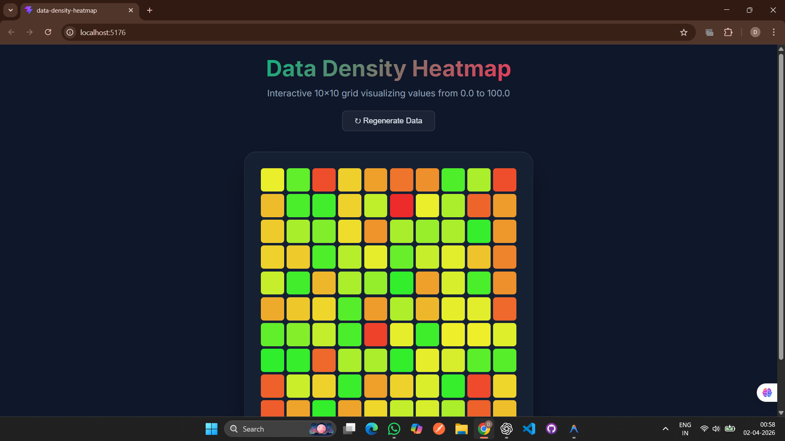

# Data Density Heatmap Application

This project is a prototype implementation of a data density heatmap visualization tool, developed as part of my GSoC 2026 preparation.

## 🚀 Features
- Heatmap grid visualization (10x10)
- Data values ranging from 0 to 100
- Color scale from low (red) to high (green)
- Hover tooltip to display values
- Clean and simple UI

## 🛠 Tech Stack
- React.js
- JavaScript
- CSS

## 📊 Purpose
This application helps visualize the completeness and distribution of data across datasets. It can assist researchers and developers in understanding data density and identifying missing or sparse data regions.

## 📸 Screenshot



## ⚙️ Installation

Clone the repository:

```bash
git clone https://github.com/kaundeep11/data-density-heatmap.git
